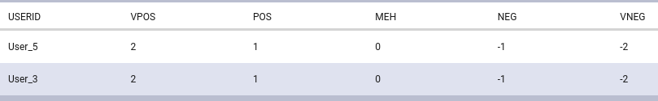
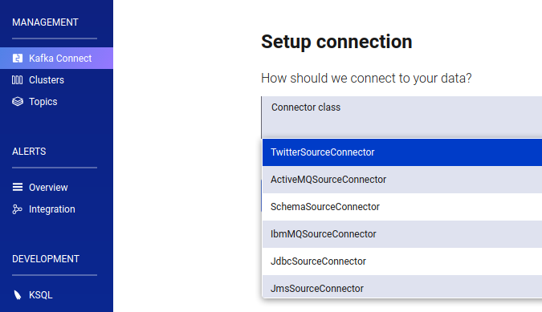
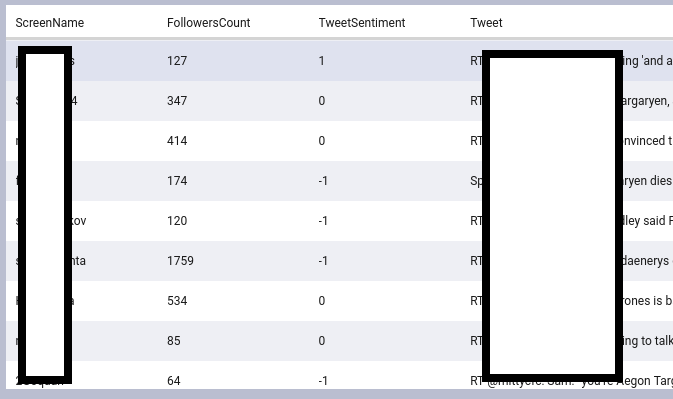
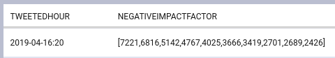

# Streaming Sentiment with Confluent Platform
## Tutorial: Using KSQL UD(A)Fs to perform sentiment analysis on Twitter Status in real time

### Background
KSQL is the Streaming SQL Engine for Apache Kafka.  KSQL supports creation of event streaming applications written with SQL-like statements.  You may want to find someone to help you brush up on your SQL.  A query like the following on your `COLLEAGUES` stream may help.
```sql
SELECT CONCAT(CONCAT(FIRSTNAME,' '),LASTNAME) as `FULLNAME`, EMAIL, MAX(AGE) AS SQLEXPERTISE
FROM COLLEAGUES
GROUP BY EMAIL;
```

The example above is a valid KSQL query.  The query incorporates functions that exist in virtually every SQL implementation.  KSQL ships with many built-in functions.  You can view the list of functions with the following KSQL statement.  If you're wondering where or how to execute the KSQL statement, note that [Confluent Control Center](https://www.confluent.io/blog/level-up-your-ksql/) includes a KSQL user interface.
```sql
SHOW FUNCTIONS;
```
Below is a sample of the results.
```json
{
  "@type": "function_names",
  "statementText": "SHOW FUNCTIONS;",
  "functions": [
    {
      "name": "CONCAT",
      "type": "scalar"
    },
    {
      "name": "MAX",
      "type": "aggregate"
    }
  ]
}
```

The sample includes the `CONCAT` and `MAX` functions used within the hypothetical KSQL query above.  Each of the functions has a type; either `scalar` or `aggregate`.  Scalar types operate on a single row of data and return a single value.  Aggregate functions operate on multiple rows of data but also return a single result.

`DESCRIBE FUNCTION [NAME]` can be used to see the detail for each function.
<details>
  <summary>`DESCRIBE FUNCTION CONCAT;`</summary>
```json
{
  "@type": "describe_function",
  "statementText": "DESCRIBE FUNCTION CONCAT;",
  "name": "CONCAT",
  "description": "",
  "author": "Confluent",
  "version": "",
  "path": "internal",
  "functions": [
    {
      "arguments": [
        {
          "name": "",
          "type": "VARCHAR",
          "description": ""
        },
        {
          "name": "",
          "type": "VARCHAR",
          "description": ""
        }
      ],
      "returnType": "VARCHAR",
      "description": "",
      "argumentTypes": [
        "VARCHAR",
        "VARCHAR"
      ]
    }
  ],
  "type": "scalar"
}
```
</details>

<details>
  <summary>`DESCRIBE FUNCTION MAX;`</summary>
```json
{
  "@type": "describe_function",
  "statementText": "DESCRIBE FUNCTION MAX;",
  "name": "MAX",
  "description": "",
  "author": "confluent",
  "version": "",
  "path": "internal",
  "functions": [
    {
      "arguments": [
        {
          "name": "",
          "type": "DOUBLE",
          "description": ""
        }
      ],
      "returnType": "DOUBLE",
      "description": "Computes the maximum double value for a key.",
      "argumentTypes": [
        "DOUBLE"
      ]
    },
    {
      "arguments": [
        {
          "name": "",
          "type": "BIGINT",
          "description": ""
        }
      ],
      "returnType": "BIGINT",
      "description": "Computes the maximum long value for a key.",
      "argumentTypes": [
        "BIGINT"
      ]
    },
    {
      "arguments": [
        {
          "name": "",
          "type": "INT",
          "description": ""
        }
      ],
      "returnType": "INT",
      "description": "Computes the maximum integer value for a key.",
      "argumentTypes": [
        "INT"
      ]
    }
  ],
  "type": "aggregate"
}
```
</details>

KSQL also supports custom user-defined functions of each function type.  They are aptly named User-Defined Functions (UDFs) and User-Defined Aggregate Functions (UDAFs).  Together, they are often referred to by UD(A)Fs.

It's remarkably simple to implement UD(A)Fs.  Under the hood, each UD(A)F is a simple Java class that uses a set of pre-built annotations for each function type (`scalar` vs. `aggregate`).  Support for UD(A)Fs enables you to implement the any of the classic SQL functions you need that aren't already built in.  It also allows you to do some things that are out of reach of your standard database-oriented SQL functions.  Since UD(A)Fs are just Java, we can create a function to compute virtually anything in real time as our event streams are consumed.

### Streaming Sentiment

Let's implement a UDF that performs [sentiment analysis](https://en.wikipedia.org/wiki/Sentiment_analysis) on text.  Not just any text of course.  It should, of course, be the sort of text that *has* sentiment, and it should be the sort of text that may arrive as a stream of data.  It should be the sort of text that everyone wants coming into their event streaming pipeline - the voice of (potential) users and customers.

It's easy to turn Twitter messages into a stream of relevant events with the Confluent Platform.  The [Kafka Connect Twitter](https://www.confluent.io/connector/kafka-connect-twitter/) connector plugin available on Confluent Hub has been created to do just that.

In this tutorial, we'll implement a UDF that categorizes text as positive or negative in sentiment.  To keep it simple, we'll just represent sentiment as a single integer in range of [-2,2].  That is we'll have -2 as very negative, 0 as neutral, and 2 as very positive.  Then we'll determine the sentiment of (potential) users and customers by using the UDF on their tweets as they are streaming in.

### Setup

In case you do not have [Confluent Platform](https://docs.confluent.io/current/platform.html) available, the [quick start](https://docs.confluent.io/current/quickstart/index.html) will get you up and running in just a few minutes.  This tutorial builds off of the Confluent Platform quick start, so ensure that you have completed steps 1-4.  Conflulent Platform deployed locally or via Docker will work fine for this tutorial.  However, note that this tutorial will be hilighting the Docker deployment of Confluent Platorm.


Since this tutorial builds from the Confluent Platform quick start, ensure that you have [created](https://docs.confluent.io/current/quickstart/ce-docker-quickstart.html#step-2-create-kafka-topics) the `pageviews` and `users` topics and ensure that you have [generated](https://docs.confluent.io/current/quickstart/ce-docker-quickstart.html#step-3-install-a-kafka-connector-and-generate-sample-data) the sample data.

The following section contains snippets that may save some time in case you are already familiar with the quick start content.  Specifically, the snippets cover steps 3 & 4.  Note that this has only been validated on Confluent Platform (Docker).
<details>
  <summary>Quickerstart</summary>

[Step 3](https://docs.confluent.io/current/quickstart/ce-docker-quickstart.html#step-3-install-a-kafka-connector-and-generate-sample-data):  Install a Kafka Connector and Generate Sample Data

Create the `datagen-pageviews` DatagenConnector source connection via `curl` in your shell.
```bash
curl -X POST http://localhost:8083/connectors \
  -H "Content-Type: application/json" \
  --data \
    '{
        "name" : "datagen-pageviews",
        "config" : {
            "connector.class": "io.confluent.kafka.connect.datagen.DatagenConnector",
            "key.converter": "org.apache.kafka.connect.storage.StringConverter",
            "kafka.topic": "pageviews",
            "max.interval": "100",
            "iterations": "1000000000",
            "quickstart": "pageviews"
        }
    }'
```

Create the `datagen-users` DatagenConnector source connection via `curl` in your shell.
```bash
curl -X POST http://localhost:8083/connectors \
  -H "Content-Type: application/json" \
  --data \
    '{
        "name" : "datagen-users",
        "config" : {
            "connector.class": "io.confluent.kafka.connect.datagen.DatagenConnector",
            "key.converter": "org.apache.kafka.connect.storage.StringConverter",
            "kafka.topic": "users",
            "max.interval": "1000",
            "iterations": "1000000000",
            "quickstart": "users"
        }
    }'
```

[Step 4](https://docs.confluent.io/current/quickstart/ce-docker-quickstart.html#step-4-create-and-write-to-a-stream-and-table-using-ksql):  Create and Write to a Stream and Table using KSQL

Execute the following KSQL statements through the KSQL user interface in Confluent Control Center.
```sql
CREATE STREAM PAGEVIEWS (viewtime BIGINT, userid VARCHAR, pageid VARCHAR) WITH (kafka_topic='pageviews', value_format='AVRO');
```

```sql
CREATE TABLE USERS (registertime BIGINT, userid VARCHAR, regionid VARCHAR, gender VARCHAR, interests ARRAY<VARCHAR>, contact_info MAP<VARCHAR, VARCHAR>) WITH (kafka_topic='users', value_format='AVRO', KEY='userid');
```

```sql
CREATE STREAM pageviews_female AS SELECT users.userid AS userid, pageid, regionid, gender FROM pageviews LEFT JOIN users ON pageviews.userid = users.userid WHERE gender = 'FEMALE';
```

```sql
CREATE STREAM pageviews_female_like_89 WITH (kafka_topic='pageviews_enriched_r8_r9', value_format='AVRO') AS SELECT * FROM pageviews_female WHERE regionid LIKE '%_8' OR regionid LIKE '%_9';
```

```sql
CREATE TABLE pageviews_regions AS SELECT gender, regionid , COUNT(*) AS numusers FROM pageviews_female WINDOW TUMBLING (size 30 second) GROUP BY gender, regionid HAVING COUNT(*) > 1;
```
</details>


### `SENTMENT(TWITTER_STATUS)`

Now that we have Confluent Platform up and running with some sample data streaming in, let's jump right into implementing our UDF.  In the first iteration, let's go with a naive implementation of sentiment analysis - where we only look for a single keyword in the text.

The Java class below imports the UDF annotations necessary to create scalar KSQL function.  Methods with the `@Udf` annotation will become KSQL functions. The annotations also serve as a means to provide user-facing documentation.  It's how you can determine what your users will see about your UDF when they execute `DESCRIBE FUNCTION SENTIMENT;` in KSQL.

Note that `@UdfParameter` may be optionally used to provide more detail about each function parameter.  It's not providing much value in the example.  It's only included for illustrative purposes.

```java
package danopkeefe.ksql.udf;

import io.confluent.ksql.function.udf.Udf;
import io.confluent.ksql.function.udf.UdfDescription;
import io.confluent.ksql.function.udf.UdfParameter;
import org.apache.commons.lang3.StringUtils;

@UdfDescription(name = "sentiment", description = "Determine sentiment as an Integer [-2,2]")
public class SentimentUdf {

    @Udf(description = "Determine sentiment as an Integer [-2,2] from a String")
    public Integer sentiment(@UdfParameter("string") final String string) {
        if(null == string || string.trim().isEmpty()) {
            return 0;
        } else if(StringUtils.containsIgnoreCase(string, "disgusting")){
            return -2;
        } else if(StringUtils.containsIgnoreCase(string, "gross")){
            return -1;
        } else if(StringUtils.containsIgnoreCase(string, "good")){
            return 1;
        } else if(StringUtils.containsIgnoreCase(string, "amazing")){
            return 2;
        } else {
            return 0;
        }
    }
}
```
In order to make the UDF available in KSQL, we need to first bundle the class inside of a fat JAR - the sort of JAR that bundles in all of its dependencies.  That's pretty easy to do with Gradle.
```groovy
plugins {
    id 'java'
}

group 'danopkeefe.ksql'
version '1.0-SNAPSHOT'

sourceCompatibility = 1.8

repositories {
    mavenCentral()
    maven { url "http://packages.confluent.io/maven/" }
}

dependencies {
    compile group: 'io.confluent.ksql', name: 'ksql-udf', version: '5.2.1'
    compile group: 'org.apache.commons', name: 'commons-lang3', version: '3.9'
}

jar {
    manifest {
        attributes(
                'Main-Class': 'package danopkeefe.ksql.udf.Sentiment'
        )
    }
    from {
        configurations.runtimeClasspath.collect { it.isDirectory() ? it : zipTree(it) }
    }
}
```
Now we need to make our JAR available to KSQL.  This step varies depending on whether Confluent Platform is deployed locally or via Docker.  With Docker, UD(A)Fs can be placed in a directory available to the KSQL container as a mounted volume.  An easy way to accomplish that is by editing the [`docker-compose.yml`](https://docs.confluent.io/current/quickstart/ce-docker-quickstart.html#step-1-download-and-start-cp-using-docker) used in the Confluent Platform quick start.
```yaml
  ksql-server:
    # ...
    environment:
      # ...
      KSQL_KSQL_EXTENSION_DIR: "/ksql_ext"
    volumes:
      - /home/dan/ksql/udf:/ksql_ext
```
The KSQL server will look for UD(A)Fs at the path specified in the environment variable `KSQL_KSQL_EXTENSION_DIR`.  Note that '/ksql_ext' is within the container's filesystem, which is where the volume comes in.  `/home/dan/ksql/udf:/ksql_ext` will mount the local directory `/home/dan/ksql/udf` in the container at `/ksql_ext`.  So now we can move the JAR into the `/home/dan/ksql/udf` and restart the `ksql-server` container.
```bash
docker-compose up -d --build
```
Once the container has been restarted, we should be able to see `SENTIMENT` via `SHOW FUNCTIONS;`.
Let's test whether our UDF can determine the sentiment of the text `amazing` with the following query.  KSQL requires `SELECT` statements to operate on a stream or table, so we can use the `USERS` table created in the quick start along with a derived column for the purpose of testing our function.
```sql
SELECT USERID,USERID,SENTIMENT('amazing') as `VPOS`
FROM USERS LIMIT 4;
```
Let's also add some additional derived column to make sure our sentiment analysis is returning the expected values.
```sql
SELECT USERID,SENTIMENT('amazing') as `VPOS`,SENTIMENT('good') as `POS`,SENTIMENT('neutral') as `MEH`,SENTIMENT('gross') as `NEG`,SENTIMENT('disgusting') as `VNEG`
FROM USERS LIMIT 4;
```
It's working as well as expected!




Now that we've got a crude implementation of our `SENTIMENT()` UDF in place, let's put it to use on a relevant stream of tweets.

Let's get the the Kafka Connect Twitter connector installed.  This step varies depending on whether Confluent Platform is deployed locally or via Docker.  For Docker, start by downloading the connector from [Confluent Hub](https://www.confluent.io/connector/kafka-connect-twitter/).  Then extract the contents of the downloaded archive.
```bash
tar -xvf kafka-connect-twitter*.tar.gz
```
Now that we have the connector, to make use of it, we need to make it available in Confluent Platform.  This can be done by reconfiguring the `connect` container via the same `docker-compose.yml` file we edited earlier.  We can make the connector plugin available by configuring an additional directory that the container will search for plugins.
```yaml
  connect:
    # ...
    environment:
      # ...
      CONNECT_PLUGIN_PATH: "/usr/share/java,/usr/share/confluent-hub-components,/kafka_connectors"
    volumes:
      - /home/dan/kafka-connectors:/kafka_connectors
```
The above configuration will enable the `connect` container discover the Twitter connector that resides `/home/dan/kafka-connectors/kafka-connect-twitter` on disk.  Now we need to restart the container for the changes to take effect.
```bash
docker-compose up -d --build
```

After the container has been restarted, the Kafka Connect Twitter will be available as an option in the list in Confluent Control Center.



You will need your Twitter API keys and tokens to set up the Kafka Connect Twitter connector.  They can be requested [here](https://developer.twitter.com).

Create a Kafka Connect Twitter source connection instance named `twitter-source-connector`.  This can be done from within Confluent Platform Control Center as illustrated in the quickstart.  Another way is to issue a `POST` to the [`/connectors`](https://docs.confluent.io/current/connect/references/restapi.html#post--connectors) endpoint of the Kafka Connect REST Interface as shown below.  You'll need to fill in the Twitter API key and token attributes with your own.  You'll also want to edit the `filter.keywords` attribute to a list of keywords that are relevant to your purpose.
```bash
curl -X POST http://localhost:8083/connectors \
  -H "Content-Type: application/json" \
  --data \
    '{
        "name" : "twitter-source-connector",
        "config" : {
            "filter.keywords" : "GameOfThrones,TheThrones,Targaryen",
            "connector.class" : "com.github.jcustenborder.kafka.connect.twitter.TwitterSourceConnector",
            "tasks.max" : "1",
            "kafka.status.topic" : "twitter_01",
            "kafka.delete.topic": "twitter_deletes_01",
            "process.deletes" : true,
            "value.converter": "org.apache.kafka.connect.json.JsonConverter",
            "value.converter.schemas.enable": false,
            "key.converter": "org.apache.kafka.connect.json.JsonConverter",
            "key.converter.schemas.enable": false,
            "twitter.oauth.accessToken" : "########",
            "twitter.oauth.accessTokenSecret" : "########",
            "twitter.oauth.consumerKey" : "########",
            "twitter.oauth.consumerSecret" : "########"
        }
    }'
```

Now lets create a stream from our `twitter-source-connector` source connector's Kafka topic `twitter_01`.
```sql
CREATE STREAM TWITTER_STATUS (
	CreatedAt BIGINT,
	Id BIGINT,
	Text STRING,
	User VARCHAR,
	Retweet BOOLEAN,
	RetweetCount INTEGER,
	Lang STRING
) WITH (KAFKA_TOPIC='twitter_01',VALUE_FORMAT='JSON');
```

Now can use test our crude Sentiment UDF along with a few other built-in UDFs on the content of the tweets as they stream in.
```sql
SELECT EXTRACTJSONFIELD(user,'$.ScreenName') as `ScreenName`,EXTRACTJSONFIELD(user,'$.FollowersCount') as `FollowersCount`, SENTIMENT(TEXT) as `TweetSentiment`, Text as `Tweet`
FROM TWITTER_STATUS
WHERE
  LANG='en'
LIMIT 50;
```
Now we can


Since everything we need for sentiment analysis on our Twitter event stream is now in place, let's circle back and see if we can make our `SENTIMENT()` UDF a little less naive.  Since our UDF is just plain old Java, we can easily drop in any Java library we'd like.  That means we can drop in the [Stanford CoreNLP](https://stanfordnlp.github.io/CoreNLP/) Java library, which includes sentiment analysis.  We can simply bundle the new dependencies into our UDFs JAR file.  Here is a slightly better implementation of `SentimentUdf.java` that uses the Stanford CoreNLP library.
<details>
  <summary>SentimentUdf</summary>
    ```java
    
    package danopkeefe.ksql.udf;

    import edu.stanford.nlp.ling.CoreAnnotations;
    import edu.stanford.nlp.neural.rnn.RNNCoreAnnotations;
    import edu.stanford.nlp.pipeline.Annotation;
    import edu.stanford.nlp.pipeline.StanfordCoreNLP;
    import edu.stanford.nlp.sentiment.SentimentCoreAnnotations;
    import edu.stanford.nlp.trees.Tree;
    import edu.stanford.nlp.util.CoreMap;
    import io.confluent.ksql.function.udf.Udf;
    import io.confluent.ksql.function.udf.UdfDescription;
    import io.confluent.ksql.function.udf.UdfParameter;

    import java.util.*;

    @UdfDescription(name = "sentiment", description = "Determine sentiment as an Integer [-2,2]")
    public class SentimentUdf {

        @Udf(description = "Determine value of String")
        public Integer sentiment(@UdfParameter("string") final String string) {
            return getAverageSentiment(string).getValue();
        }


        Sentiment getAverageSentiment(final String string) {
            if(null == string || string.trim().isEmpty()) {
                return Sentiment.NEUTRAL;
            } else {
                Properties props = new Properties();
                props.setProperty("annotators", "tokenize, ssplit, parse, sentiment");
                StanfordCoreNLP pipeline = new StanfordCoreNLP(props);
                Annotation annotation = pipeline.process(string);
                List<Sentiment> sentenceSentiments = new ArrayList<>();

                for (CoreMap sentence : annotation.get(CoreAnnotations.SentencesAnnotation.class)) {
                    Tree tree = sentence.get(SentimentCoreAnnotations.SentimentAnnotatedTree.class);
                    Sentiment sentiment = getSentimentFromPredictedClass(RNNCoreAnnotations.getPredictedClass(tree));
                    sentenceSentiments.add(sentiment);
                }
                long meanSentiment = Math.round(sentenceSentiments.stream().mapToInt(Sentiment::getValue).average().orElse(0));
                return Sentiment.fromInt((int) meanSentiment);
            }
        }

        Sentiment getSentimentFromPredictedClass(int predictedClass) {
            switch (predictedClass) {
                case 0:
                    return Sentiment.VERY_NEGATIVE;
                case 1:
                    return Sentiment.NEGATIVE;
                case 3:
                    return Sentiment.POSITIVE;
                case 4:
                    return Sentiment.VERY_POSITIVE;
                default:
                    return Sentiment.NEUTRAL;
            }
        }

        enum Sentiment {
            VERY_NEGATIVE(-2),
            NEGATIVE(-1),
            NEUTRAL(0),
            POSITIVE(1),
            VERY_POSITIVE(2);

            private final int value;

            Sentiment(int value) {
                this.value = value;
            }

            public int getValue() {
                return this.value;
            }
            private static final Map<Integer, Sentiment> intToTypeMap = new HashMap<Integer, Sentiment>();
            static {
                for (Sentiment sentiment : Sentiment.values()) {
                    intToTypeMap.put(sentiment.value, sentiment);
                }
            }

            public static Sentiment fromInt(int i) {
                return intToTypeMap.get(i);
            }
        }
    }
    ```
</details>

Now we can package the JAR and replace our old JAR in the local directory `/home/dan/ksql/udf`.  KSQL will need to be restarted in order to pick up the revamped UDF within new JAR.  Since we haven't edited the `docker-compose.yml` since we last restarted the KSQL container, `docker-compose up -d --build` will not be sufficient on its own.  So let's first explicitly stop the `ksql-server` container.
```bash
docker stop ksql-server
docker-compose up -d --build
```

Now that our revamped UDF implementation is available in KSQL, let's see the improved sentiment function in action.
```sql
SELECT EXTRACTJSONFIELD(user,'$.ScreenName') as `ScreenName`,EXTRACTJSONFIELD(user,'$.FollowersCount') as `FollowersCount`, SENTIMENT(TEXT) as `TweetSentiment`, Text as `Tweet`
FROM TWITTER_STATUS
WHERE
  LANG='en'
LIMIT 50;
```


We can easily persist that query into a new stream that has our sentiment values.  Let's also add the timestamp of the tweet.
NOTE: `CREATE STREAM` does not like back ticks around column aliases!
```sql
CREATE STREAM TWITTER_STATUS_SENTIMENT WITH (VALUE_FORMAT='JSON') AS
SELECT TIMESTAMPTOSTRING(CreatedAt, 'yyyy-MM-dd HH:mm:ss.SSS') AS TweetedAt, EXTRACTJSONFIELD(user,'$.ScreenName') as ScreenName,EXTRACTJSONFIELD(user,'$.FollowersCount') as FollowersCount, SENTIMENT(TEXT) as TweetSentiment, Text as Tweet
FROM TWITTER_STATUS
WHERE LANG='en';
```

Let's make sure our stream has what we want.
```sql
SELECT TWEETEDAT, FOLLOWERSCOUNT, TWEETSENTIMENT
FROM TWITTER_STATUS_SENTIMENT
LIMIT 50;
```

### Now What?

We can now reap the benefits of the UDF on our new event stream.  We could easily adapt the approach to help in PR disaster mitigation by aggregating negative tweets over a window of time based on the potential impact of the tweet or Twitter user.  If we wanted to determine the potential impact based on the number of followers a Twitter user has, we could do something like the following to obtain an up-to-date list of tweets that are negative in sentiment and also that have the biggest potential impact.  The results will be aggregated per hour in real time.
```sql
SELECT TIMESTAMPTOSTRING(STRINGTOTIMESTAMP(TWEETEDAT, 'yyyy-MM-dd HH:mm:ss.SSS'),'yyyy-MM-dd:HH') as TWEETEDHOUR, TOPK(ABS(CAST(FOLLOWERSCOUNT AS BIGINT) * TWEETSENTIMENT), 10) AS NEGATIVEIMPACTFACTOR
FROM TWITTER_STATUS_SENTIMENT WINDOW TUMBLING (SIZE 1 HOUR)
WHERE TWEETSENTIMENT < 0
GROUP BY TIMESTAMPTOSTRING(STRINGTOTIMESTAMP(TWEETEDAT, 'yyyy-MM-dd HH:mm:ss.SSS'),'yyyy-MM-dd:HH');
```


A query like the above could be used to hone in on potential PR disasters that are about to unfold on Twitter.  Leveraging customer voice data as a stream of events opens the door to possibilities like proactive PR disaster mitigation when they can be filtered by relevance in real time!

In lieu of having a PR swat team on hand, visualizations may be warranted.  The sentiment-enriched event stream could be sent to an Elasticsearch cluster via the [Kafka Connect Elasticsearch Connector](https://www.confluent.io/connector/kafka-connect-elasticsearch/).  After the data arrives in your Elasticsearch cluster, you'll have to make that contentious choice of creating visualizations in Grafana or Kibana.

#### What else?
We could use a slightly different approach from the aforementioned to monitor sentiment in real time by correlating it with other events in disparate streams.  For example, we could join our Twitter event stream to a hypothetical advertising even stream - one that includes the time an ad aired along with some relevant keywords summarizing the ads.  Each event in the ad stream may warrant some sentiment analysis for a window of time after ad event occurred.  Then you'd be able to get a real-time sentiment stream from Twitter about the new product announced in a TV commercial.

The UDF we created for determining sentiment is now available for use with all of the streams in your pipelines via KSQL.  The UDF only cares about the type of its input parameters.  We could use the UDF with any other stream of events in our pipeline.

Enriching our streams with sentiment analysis via KSQL UD(A)Fs has a surprisingly low barrier of entry.  Using Confluent Platform along with ready-made Connector Plugins from Confluent Hub enables us to incorporate sentiment analysis into our even streams in under 30 minutes.  Of course it helps to be standing on the shoulders of giants like those Stanford!

### Building the project
A fat JAR containing the sentiment UDF can be built as follows.
```bash
git clone https://github.com/danopkeefe/KSQL-Streaming-Sentiment.git
cd KSQL-Streaming-Sentiment
./gradlew jar
```